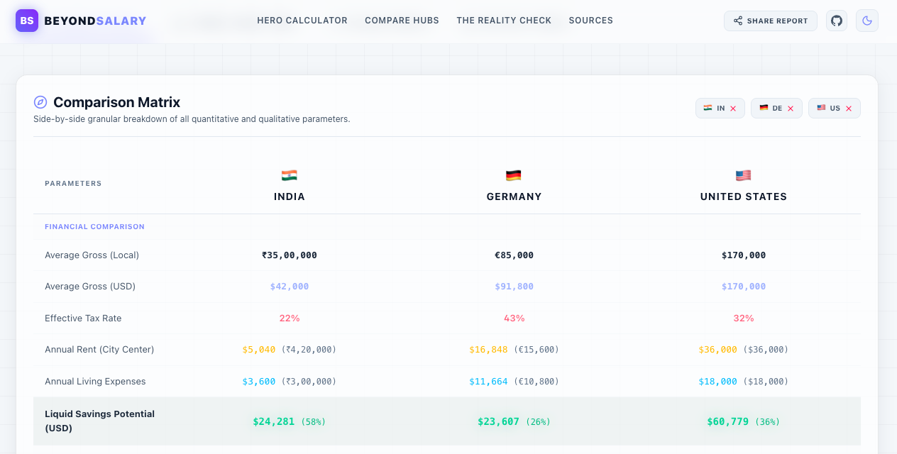

# BeyondSalary 🌐💼



An interactive, premium data-journalism storytelling dashboard designed for software engineers to compare **compensation, cost of living, social safety nets, and overall quality of life** across the top tech destinations in the world. 

BeyondSalary shifts the focus from simple gross numbers to real liquid cash retention and everyday living parameters.

---

## 🚀 Key Features

* **Interactive Hero Calculator**: Compare any two tech hubs side-by-side. Slide local salary expectations and watch tax deductions, average rent, and living costs compute in real-time.
* **QoL Matchup Indicators**: Instant lookups for safety, weekly work hours, mandatory paid leave, public transit scores, air quality index, and layoff protections on the first screen.
* **Global Experience Selectors**: Switch compensation calculations dynamically across **Junior, Mid, Senior, and Lead** brackets.
* **Detailed Comparison Matrix**: A granular data table comparing all 9 tech hubs (India, Germany, Netherlands, Sweden, United Kingdom, Canada, USA, Switzerland, Singapore) on quantitative scores and detailed qualitative parameters.
* **Qualitative Systems & Infrastructure Data**:
  * **Severance & Unemployment Benefits**: Review legal severance expectations and government support safety nets.
  * **Healthcare Access & Friction**: Understand wait times for specialists and GP gatekeeper structures.
  * **Legal System & Rules**: Insights on judicial efficiency, dispute resolution costs, and labor court protections.
  * **Local Transportation**: Detail cycling culture, railway infrastructures, and car ownership necessity.
* **Savings Sandbox Simulator**: An interactive budget playground with circular progress gauges. Adjust personal tax rates, rent, and monthly savings potential to simulate exact finance models and compare them directly against benchmark country averages.
* **Reality Check Cards**: Visa framework paths (EU Blue Cards, H1B Lotteries, Express Entry points), PR paths, notice periods, and hard-hitting pros/cons.

---

## 🛠️ Technology Stack

* **Core**: [Next.js (App Router)](https://nextjs.org/) + [React](https://react.dev/) + [TypeScript](https://www.typescriptlang.org/)
* **Styling**: [Tailwind CSS](https://tailwindcss.com/) (translucent glassmorphic themes, responsive grids, dark mode first, custom ranges)
* **Animations**: [Framer Motion](https://www.framer.com/motion/) (micro-interactions, page section fade-ins, tab switches)
* **Data Visualization**: [Recharts](https://recharts.org/) (Custom multi-data radar charts, horizontal bar charts for liquid savings, and grouped bar charts for working hours vs vacation days)

---

## 📂 Project Structure

```
src/
├── app/
│   ├── layout.tsx         # HTML shell, custom Google Fonts, global dark layout
│   ├── page.tsx           # Page assembler, sections container (modularized)
│   └── globals.css        # Glassmorphic utilities, custom scrollbars, range inputs
├── components/
│   ├── Header.tsx         # Navigation header, logo, share trigger
│   ├── Footer.tsx         # Social links (Twitter, LinkedIn, GitHub), copyright
│   ├── HeroSection.tsx    # Interactive calculators, sliders, QoL matchup grid
│   ├── CompareDashboard.tsx # Controller state, country filters, preset toggles, tabs
│   ├── ComparisonTray.tsx # Granular comparison matrix table (qualitative descriptions)
│   ├── RealityCheck.tsx   # Visa framework, PR, pros/cons list, infrastructure details
│   ├── SavingsSimulator.tsx # Savings sandbox calculator, circular budget gauge
│   ├── MetricsVisualizer.tsx # Recharts visualizations (Radar, group/horizontal bars)
│   └── ui/
│       ├── Card.tsx       # Glassmorphic translucent card container
│       └── ShareButton.tsx # Client Web Share API & Clipboard fallback copying
├── data/
│   └── countries.json     # Complete datasets for top 9 developer choice countries
├── types/
│   └── index.ts           # Strong typescript interfaces for data schemas
└── utils/
    └── helpers.ts         # Math calculators, exchange rate converters, formatters
```

---

## 💻 Getting Started

### Prerequisites

Ensure you have [Node.js](https://nodejs.org/) installed (v18+ recommended).

### Install Dependencies

```bash
npm install
```

### Run Development Server

```bash
npm run dev
```

Open [http://localhost:3000](http://localhost:3000) in your browser.

### Build Production Bundle

To build and compile the Next.js static production bundle:

```bash
npm run build
```

### Deploy on Vercel

The easiest way to deploy your Next.js app is to use the [Vercel Platform](https://vercel.com/new?utm_medium=default-template&filter=next.js&utm_source=create-next-app-readme) from the creators of Next.js.

Check out our [Next.js deployment documentation](https://nextjs.org/docs/app/building-your-application/deploying) for more details.

---

## 🛡️ License

This project is licensed under the permissive **MIT License** - see the [LICENSE](LICENSE) file for details.

Developed with 💻 by [Abhinav Rai](https://abhinavrai23.github.io/).
